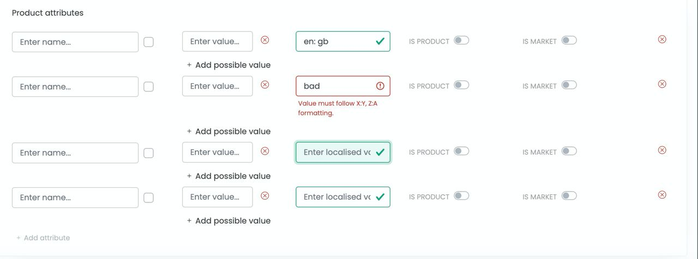
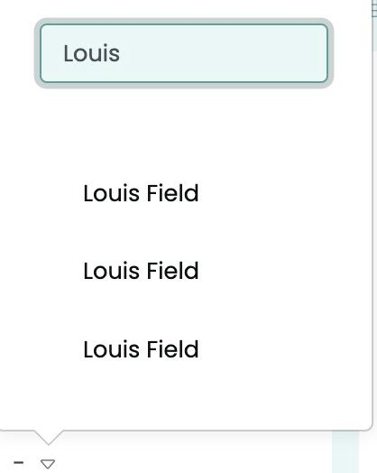

# Otta - Engineering Interview Task

This is the take-home interview task for engineering job applications at Otta.

The goal is to both give you a flavour of the kind of work we do, and give us an idea of your technical (and non-technical) skills. The key thing we're assessing is your level of pragmatism, but we're also interested in code style and how you structure the problem (so please don't just do it in SQL!)

We expect the task to take one hour. If you require clarification on anything, please don't hesitate to contact us.

## Instructions

Start by cloning this repository using your personal GitHub account. Create a new private repository and push your clone to this new repo (you will need to remove the original remote with `git remote remove origin`). Please ensure all of your work is committed to this - we'll only consider the `main` branch.

The following details the individual tasks. Please complete **all** of the them. You may **use any programming language**, provided all of the code used can be committed to this repo. You don't need to provide instructions for running the code, or any explanation other than the answers.

### Task 1

In the `data` folder of this repo there is a CSV file called `reactions.csv`. It contains real data corresponding to how users on Otta have reacted to (saved or skipped) jobs on the platform.

The reaction data consists of four columns:

- `user_id` - the integer ID of the user who liked or disliked the job
- `job_id` - the integer ID of the job the user interacted with
- `direction` - whether the user liked (`true`) or disliked (`false`) the job
- `time` - the timestamp corresponding to when they reacted to the job

**Task**: The similarity score between two users is the number of jobs which they both like. Find the two users with the highest similarity.

**Answer**: _[1791 (user id), 5193 (user id) & 301 (score)]_

### Task 2

In the `data` folder there is an additional CSV file called `jobs.csv`. It contains unique integer IDs for over 12,000 jobs, along with integer IDs for the job's associated company.

**Task**: The similarity score between two companies is the number of users who like at least one job at both companies. Using both the `reactions.csv` and `jobs.csv` data, find the two companies with the highest similarity score.

**Answer**: _[92 (company id), 46(company id) & 104 (score)]_

### Task 3

Engineering at Otta is truly full-stack. Features are owned end-to-end, from backend and database-level work to front-end finishes.

We don't think it's fair to ask you to build something with a UI, as we know this can take a while and time is precious. Instead, we'd love to see an example of something you've already built and hear about what you learned building it.

**Task**: Share an example of something you've built using front-end web technologies.

- A link to a GitHub repo is ideal
- If the best example of your work is something you've done at a company, it's okay to link to a live deployed version
- If you can't link to anything, a screenshot is also fine

**Answer**: The following screenshots are of two features I have built at Eebz. The first task was to add a "localised value" field as part of an 'Attributes' (such as Product attributes) form whereby the value of each attribute within the parent attribute may have a localised value. The second task was to create a generic popup component to show a list of values (names) and make it searchable by text while also being capable of arrow key input. 
 

**Task**: Tell us about the biggest challenge you faced in building the above.

**Answer**:  The biggest challenge of the first task was to find the most optimal way to perform state validation on each individual localised value as there is a validation requirement stating that the string value must be in the format X:Y, Z:A as shown in the above image. Making this state-reactive as well as affect the individual row was complex, since even though we were able to create validation through the use of Array.map and Array.filter functions, new localised values could not be saved as the values passed through needed to be converted into an object for the PostgreSQL table. I solved this by using JavaScript Array.map and Array.reduce functions after splitting inputted string using the punctuation in the string.

The biggest challenge of the second task was to implement a popup component with functionality that enabled it to be searchable in a variety of ways. The main way to search is via text input, but in addition to that, there was a requirement to allow the user to be able to utilise the keyboard so that they can traverse through the resulting list using arrow keys and be able to select and save a value using the enter key. This was achieved by setting an ID to every result value based on the index of the array. A user would be able to traverse the array with their arrow keys and the UI would focus on the current element based on the resulting index. 

## Submission

Once you've completed all of the above tasks, make sure:

- [ ] You've committed all of the code used, and your edited answers, to the `main` branch
- [ ] You've pushed the changes to your repo
- [ ] You add `XavKearney` and `billyotta` as contributors for your personal repo, and send a link to the repo in an email or Otta message to us

Good luck!
